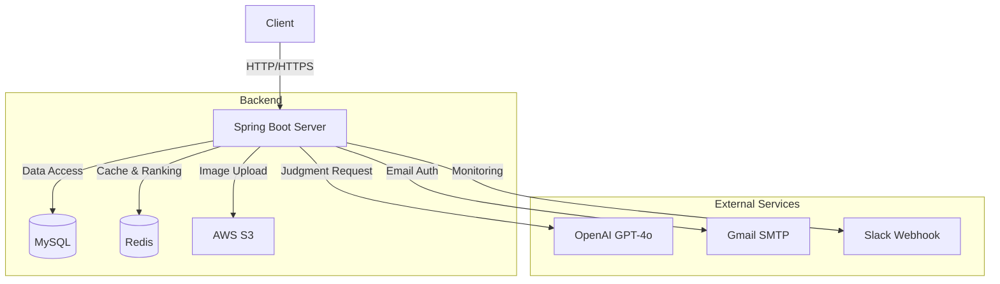

# DdangDdangDdang (땅땅땅) SERVER

**AI 판사와 함께하는 밸런스 게임 & 토론 플랫폼 ‘땅땅땅’**의 백엔드 서버입니다.

> **"그 사건, AI 판사는 어떻게 생각할까?"** \
> 사용자가 제기한 밸런스 게임 안건에 대해 **AI가 즉결 심판**을 내리고,  
> 유저들이 변호사가 되어 **토론 및 투표**를 통해 최종 판결을 내리는 **AI 기반 법정 토론 플랫폼**입니다.

Client : https://ddang-ddang-ddang-fe-8npo.vercel.app/<br>
Server : https://ddangx3.site/

## 📖 프로젝트 소개

**땅땅땅**은 단순한 밸런스 게임을 넘어, **AI(ChatGPT)와의 상호작용**과 **사용자 간의 논리 대결**을 결합한 서비스입니다.  
재판은 총 3단계로 진행되며, 각 단계마다 차별화된 경험을 제공합니다.

### 🔄 재판 프로세스 (Core Flow)

1.  **1차 재판 (초심)**: 사용자가 사건(주제)과 양측 입장을 등록하면, **AI 판사**가 즉시 논리를 분석하여 1차 판결을 내립니다.
2.  **2차 재판 (항소/토론)**: 유저들은 배심원이 되어 '변론(게시글)'과 '반론(대댓글)'을 작성하고, 투표를 통해 여론을 형성합니다.
3.  **3차 재판 (최종심)**: 투표 결과와 채택된 우수 변론들을 종합하여 **AI가 최종 판결문**을 확정 짓습니다.


## 🛠️ Tech Stack

| Category | Stack |
|---|---|
| **Language** | Java 17 |
| **Framework** | Spring Boot 3.5.6 |
| **ORM / DB** | Spring Data JPA, MySQL, H2(Test), Redis |
| **Auth / Security** | Spring Security, JWT (Access/Refresh Token) |
| **Infra / Storage** | AWS S3, EC2, RDS |
| **AI / LLM** | OpenAI API (GPT-4o) |
| **Mail / Noti** | JavaMailSender, Slack Webhook, SSE |
| **Build / Deploy** | Gradle, GitHub Actions |
| **Etc** | Lombok, Swagger (SpringDoc), WebSocket(SSE) |


## ✨ Key Features

### 1\. AI 판사 & 사건 관리

  * **솔로/파티 모드**: 혼자서 결과를 확인하거나(Solo), 대기방을 만들어 타인과 대결(Party/VS)할 수 있습니다.
  * **실시간 AI 판결**: OpenAI API를 연동하여, 양측 주장의 논리적 허점을 분석하고 승소 비율(%)과 판결문을 실시간으로 생성합니다.

### 2\. 리얼타임 토론 시스템

  * **변론 및 반론**: 계층형 댓글 구조(변론-반론-대대댓글)를 통해 깊이 있는 토론이 가능합니다.
  * **실시간 상호작용**: `SSE(Server-Sent Events)`를 적용하여, 내 글에 반론이 달리거나 판결이 나면 즉시 알림을 받습니다.
  * **좋아요 & 투표**: 유저들의 공감을 얻은 의견은 상위 노출되며, 투표 결과는 최종심에 반영됩니다.

### 3\. 게이미피케이션 (MyPage)

  * **랭킹 시스템**: `Redis ZSet`을 활용하여 실시간으로 '핫한 토론'과 '유저 랭킹'을 산정합니다.
  * **업적 & 등급**: 활동량(승소, 댓글 수 등)에 따라 경험치(EXP)를 획득하고, '변호사', '판사' 등으로 등급이 승격됩니다.

### 4\. 운영 및 모니터링

  * **신고 자동화**: 욕설/비방 등 부적절한 변론이 누적 신고(5회)되면 자동으로 블라인드 처리되고 Slack으로 알림이 전송됩니다.
  * **스케줄러**: 매일 자정, 마감된 사건들의 인기 의견을 자동으로 채택하여 최종 판결을 진행합니다.

## 🔍 상세 기능 명세

### 🧩 인증 및 유저 관리

  - **회원가입/로그인** → `POST /api/v1/auth/signup`, `/login`
  - **이메일 인증** → 인증번호 발송/검증 (`/email/send-code`, `/verify-code`)
  - **토큰 재발급** → `POST /api/v1/auth/refresh`
  - **프로필 관리** → 정보 수정, 프로필 이미지 S3 업로드 (`/api/users/...`)

### ⚖️ 사건 관리 및 1차 재판

  - **사건 생성** → 솔로/VS 모드 선택 (`POST /api/v1/cases`)
  - **VS 모드 매칭** → 대기 목록 조회 및 입장문 제출로 참여 (`/api/v1/cases/pending`)
  - **AI 1차 판결** → 양측 입장 분석 후 즉시 판결문 생성

### 🗣️ 2차 재판 (토론 및 투표)

  - **변론/반론** → 의견 작성(CRUD), 계층형 댓글 구조 (대댓글)
  - **배심원 투표** → A/B 진영 투표 (`POST /api/v1/cases/{caseId}/vote`)
  - **좋아요** → 변론/반론 좋아요 및 랭킹 점수 반영 (`/api/likes`)

### 👨‍⚖️ 3차 재판 (최종 판결)

  - **의견 채택** → 사용자가 최종심에 반영할 의견 선택 (`/api/final/adopt`)
  - **자동 채택** → 스케줄러(매일 자정)가 투표 마감된 사건의 인기 의견 자동 채택
  - **AI 최종 판결** → 채택된 의견 + 투표 결과를 종합하여 최종 판결문 생성 (비동기 처리를 통한 판결 중 다른 요청 수행 가능, 완료 시 알림)
  - **AI 최종 판결 스케쥴러** → 매일 자정 인기 의견이 변동된 사건 판결문 업데이트 (비동기 처리를 통한 판결 중 다른 요청 수행 가능)
  - **승패 정산** → 결과에 따라 경험치(EXP) 및 승/패 기록 업데이트
  - **판결 아카이브** → 사건에 대한 그동안의 판결문 기록

### 🏆 랭킹 및 홈 화면

  - **실시간 핫한 토론** → Redis ZSet 기반 인기 게시글 노출 (`/api/home/hot`)
  - **유저 랭킹** → 경험치 기반 등급(변호사, 판사 등) 부여

### 🔔 알림 및 신고

  - **실시간 알림** → SSE(Server-Sent Events)로 내 글에 달린 댓글/판결 완료 알림
  - **신고 기능** → 부적절한 콘텐츠 신고, 5회 누적 시 자동 블라인드 & Slack 알림 전송

## 🏛️ System Architecture




## 📂 Project Structure

```bash
com.demoday.ddangddangddang
├── controller      # API 엔드포인트 (Case, Debate, Final, Auth 등)
├── service         # 비즈니스 로직 (AI 판결, 랭킹 산정, 투표 처리)
├── repository      # DB 접근 계층 (JPA)
├── domain          # 엔티티 설계 (User, Case, Judgment, Defense...)
├── dto             # 데이터 전송 객체 (Request/Response)
└── global
    ├── config      # Security, Swagger, S3, Redis 설정
    ├── jwt         # JWT 인증 필터 및 Provider
    ├── sse         # 실시간 알림 (SSE) 구현
    └── exception   # 커스텀 예외 처리
```


## 🚀 Deployment Pipeline

GitHub Main 브랜치에 코드가 푸시되면, **GitHub Actions**가 자동으로 빌드 및 배포를 수행합니다.

1.  **Code Push**: `main` 브랜치 병합
2.  **Build**: JDK 17 환경에서 Gradle 빌드 (Test 제외)
3.  **Transfer**: 빌드된 JAR 파일을 AWS EC2로 전송 (SCP)
4.  **Deploy**: EC2 내부 스크립트를 통해 기존 프로세스 종료 후 재시작 (`nohup`)


## 📝 API Documentation

서버 실행 후 아래 주소에서 **Swagger UI**를 통해 API 명세를 확인하고 테스트할 수 있습니다.

  * **Swagger URL**: `https://ddangx3.site/swagger-ui/index.html`
      * *(로컬 환경: `http://localhost:8080/swagger-ui/index.html`)*


## 🧑‍💻 Contributors

|  이름  | 역할 | 담당 기능 |
|---|---|---|
| **[@shinae1023](https://github.com/shinae1023)** | 백엔드 | **최종 판결(3차)** 로직, 의견 채택 및 자동 채택 스케줄러,<br> 마이페이지, 좋아요 기능, 알림(SSE), 메인페이지, 배포 및 CI/CD 구현 |
| **[@whc9999](https://github.com/whc9999)** | 백엔드 | **인증(Auth)** 및 회원가입(이메일 인증), **사건 생성(1차)** 및 VS 모드 매칭, <br> **2차 재판** 변론/반론 및 투표 시스템, 최종 판결 스케줄러, 신고 기능 구현 |
